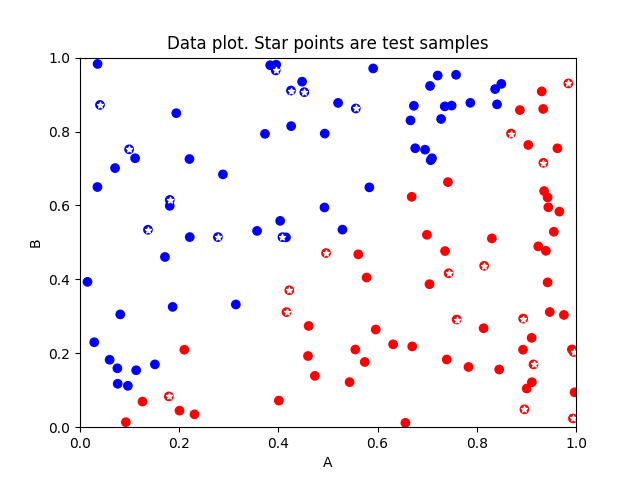
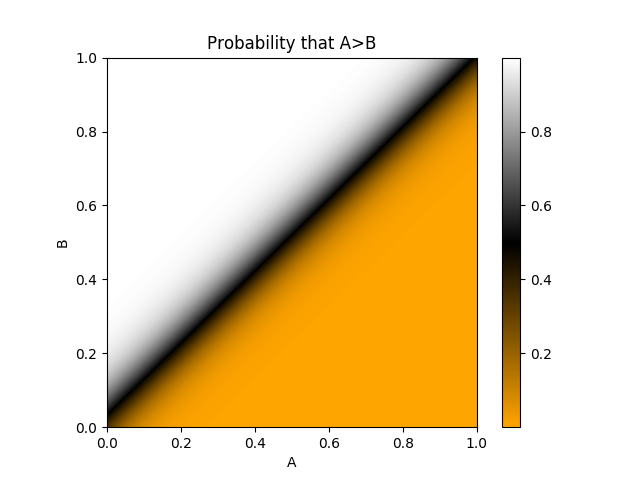
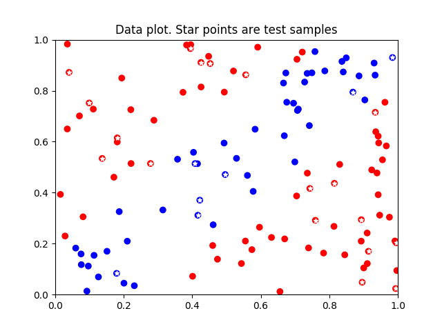

# Examples
## A > B (a_greater_than_b.py)
With this example we intend to show that a neural network without hidden layers can perfectly classify linearly separable data.

Let A and B be variables with domain [0,1]. The goal of this example is to determine whether A > B. In other words, we want to build a classifier that outputs 1 when A > B and 0 otherwise.

The random generated data used in this example is shown next:

*
Figure 1: Train and test data for A > B
*

Being able to generalize to new samples is commonly a desirable property of classifiers. A requirement for this property is that the training set must be representative of the whole population. In the plot above, we've selected some samples (star points) to be classified without training on them (test data). Training data (rest of samples) are obviously representative of these test samples. 

Note that we could easily draw a straight line that would separate red samples (A>B) from blue samples (A<=B). Thus, we can say that this dataset is linearly separable. When data is linearly separable, classifying it is straightforward. For example, we can use logistic regression (which is equivalent to using a neural without any hidden layer) to classify it.

Classification boundaries obtained by training a neural network without hidden layers for this dataset are shown next:

*
Figure 2: Classifier boundaries for A > B 
*

## A aprox B (a_aprox_b.py)
With this example we intend to show that a neural network requires hidden layers to classify non-linear separable data. We also aim to explain the intuition behind the inner representations of data that neural networks try to learn.

Let A and B be variables with domain [0,1]. The goal of this example is to determine whether are approximately equal (we say that two variables A and B are approximately equal if abs(A - B) <= 0.2). In other words, we want to build a classifier that outputs 1 when abs(A - B) > 0.2 and 0 otherwise.

The random generated data used in this example is shown next (star points are test samples, while other points are training samples):

*
Figure 3: Train and test data for A aprox B
*

What can we say about linear separability for this dataset?

This dataset **is not** linearly separable, because we can't separate it using a linear model. For example, if we try to classify this dataset using a neural network without hidden layers, we get the next classifier boundaries:

*
Figure 4: Classifier boundaries for A aprox B using a neural network without hidden layers
*

The neural network can't draw a straight line separating one class for another correctly, although it still tries to find the linear model with the lowest loss.

Here's where learning inner representations of data can make the difference. Neural networks can learn these inner representations through hidden layers, and that's why they are so powerful. Accompanied by a proper non-linear activation function, hidden layers can transform its input data into a more abstract non-linear space.

By learning multiple successive inner representations of data we expect to find a transformation such that the resulting latent data is linearly separable. Once we achieve that, performing a simple logistic regression on top of the network will make an accurate classification, just like what we've seen in the previous example.

Understanding why we need inner representations is the key concept of deep neural networks. Let's discuss it in our example. Recall that we weren't able to separate one class from another with a straight line. Imagine you have *Figure 3* plotted on a transparent sheet. What would you do to make data linearly separable?

You could fold the transparent sheet in such a way that coordinates (0, 1) and (1, 0) happen to meet. Now you can draw a straight line on the transparent sheet that separates one class from another. The resulting inner representation is linearly separable, and that's exactly what a neural network does!

*
Figure 5: Classifier boundaries for A aprox B using a neural network with a hidden layer. This is what we get after unfolding the transparent sheet.
*
